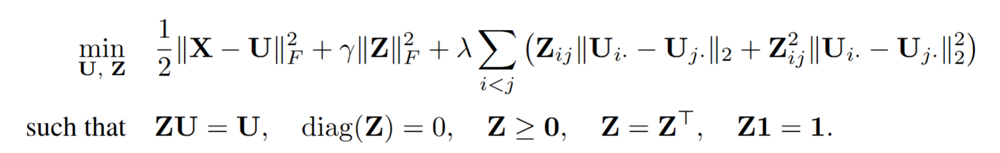

# Beyond Local Centers toward Prototypes: Joint Learning of Self-Representation and Adaptive Clustering

This repository contains the code used to fit the proposed adaptive convex clustering model and the baseline prototype-based methods used in the experiments.

## Method

Given a data matrix $\mathbf{X} \in \mathbb{R}^{n \times p}$, the proposed method jointly learns a prototype matrix $U$ and an adaptive proximity matrix $Z$.

<p align="center">
  
</p>

Here, $\lambda,\gamma > 0$, $U_{i\cdot}$ denotes the $i$-th row of $U$, and $Z_{ij}$ denotes the $(i,j)$-th element of $Z$. The unique rows of $U$ are used as learned prototypes.

## Repository Structure

```text
.
├── README.md
├── supplementary_material.pdf
├── method.png
├── admm.R
├── install.R
├── run_ours.R
├── run_cvscls.R
├── run_baselines.R
├── realdata/
└── simulation/
```

## Supplementary Material

The file `supplementary_material.pdf` contains additional algorithmic details and experimental results that are not included in the main paper.

## Scripts

All scripts should be run from the repository root directory.

### `install.R`

Installs the R packages required for fitting the proposed method and the baseline methods.

```bash
Rscript install.R
```

### `simulation/moon.R`

Generates the two-moon synthetic dataset.

```bash
Rscript simulation/moon.R
```

The generated files are

```text
simulation/moon.Rds
simulation/moon_true.Rds
```

### `simulation/ring.R`

Generates the 3D ring synthetic dataset.

```bash
Rscript simulation/ring.R
```

The generated files are

```text
simulation/ring.Rds
simulation/ring_true.Rds
```

### `simulation/spiral.R`

Generates the 3D spiral synthetic dataset.

```bash
Rscript simulation/spiral.R
```

The generated files are

```text
simulation/spiral.Rds
simulation/spiral_true.Rds
```

### `run_ours.R`

Runs the proposed method on the real datasets stored in `realdata/`.

```bash
Rscript run_ours.R
```

The results are saved under

```text
realdata/results_ours/
```

### `run_cvscls.R`

Runs the standard convex clustering baseline using the `cvxclustr` package.

```bash
Rscript run_cvscls.R
```

The results are saved under

```text
realdata/results_baseline/
```

### `run_baselines.R`

Runs the following prototype-based baseline methods:

- k-means
- k-medoids
- self-organizing map
- neural gas

```bash
Rscript run_baselines.R
```

The results are saved under

```text
realdata/results_baseline/
```

### `admm.R`

Implements the ADMM solver for the proposed optimization problem. This file is sourced by `run_ours.R` and does not need to be run directly.

## Data Format

Each dataset is stored as an `.Rds` file. The corresponding ground-truth labels are stored using the suffix `_true.Rds`.

For example:

```text
iris_train.Rds
iris_train_true.Rds
iris_test.Rds
iris_test_true.Rds
```

The data files contain numeric matrices, and the label files contain class labels.

## Main Parameters

The proposed method uses the following default settings:

```text
rho = 1000
a = 1e-7
mu = n^2 * rho * ((1 - a) / a)
lambda grid = 60 logarithmically spaced values from 10 to 10000
gamma = 10
```

The convex clustering baseline uses the following settings:

```text
k-nearest-neighbor graph sizes = 5, 10, 20
gamma grid = 60 logarithmically spaced values from 10 to 10000
```

The other baseline methods are evaluated over the following settings:

```text
number of prototypes k = 2, ..., 50
random seeds = 1001, ..., 1020
```
